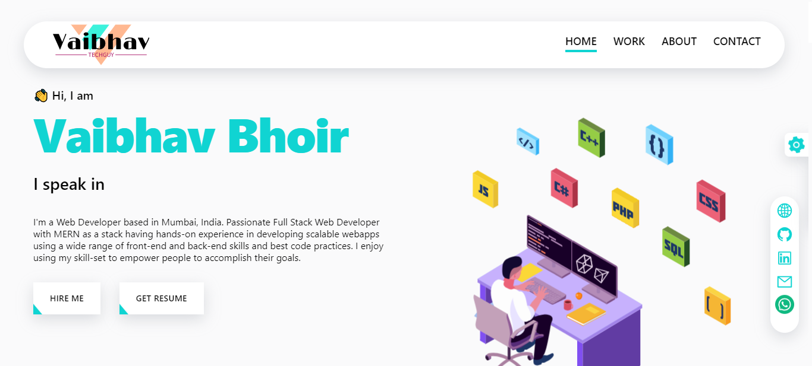

# Portfolio Website

This is my Portfolio Website made with nextJs, tailwind CSS, react-hook-forms, mongoDB and contentfull CMS.

## Preview

### Dark Mode

### Light Mode

## Technologies Used

### Next.js

[Next.js](https://nextjs.org/) is a React framework that enables server-side rendering, static site generation, and client-side rendering with built-in TypeScript support.

### Tailwind CSS

[Tailwind CSS](https://tailwindcss.com/) is a utility-first CSS framework that allows for rapid UI development by composing styles from small, single-purpose utility classes.

### React Hook Form

[React Hook Form](https://react-hook-form.com/) is a lightweight and performant form validation library for React applications, offering a simple and intuitive API. It is chosen for its ease of use and flexibility in handling form validation requirements.

### Contentful CMS

[Contentful](https://www.contentful.com/) is a headless content management system (CMS) that provides a flexible and easy-to-use interface for creating and managing content, which is then consumed by the portfolio website.

### MongoDB

[MongoDB](https://www.mongodb.com/) is a NoSQL database is integrated into the portfolio website to store form data submitted by visitors.

### Lottie

[Lottie](https://airbnb.io/lottie/) is a library used for creating visually appealing animations on the website. It is utilized to enhance the user experience by incorporating interactive and engaging animations that showcase projects and highlight key features of the portfolio website.

## License

This project is licensed under the MIT License - see the [LICENSE](LICENSE) file for details.
